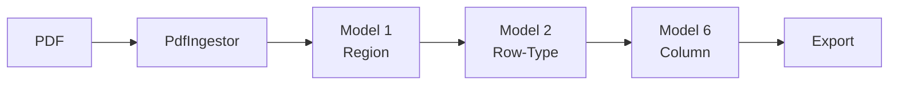
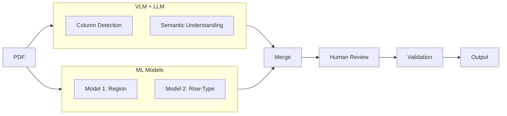
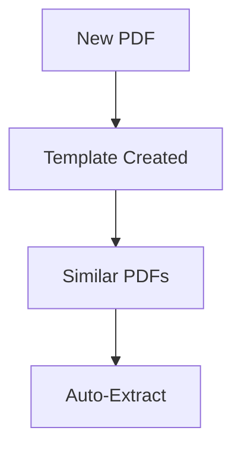

# ARCHITECTURE.md

## System Architecture

GLASS is a hybrid system combining Vision-Language Models, heuristic validation, and human-in-the-loop refinement.

---

## v1 Architecture (Academic)

Pure ML pipeline from the research paper:



| Model | Task | Accuracy |
|-------|------|----------|
| Model 1 | Region Classification | 99.96% |
| Model 2 | Row-Type Classification | 99.33% |
| Model 6 | Column Detection | 86.6% K-acc |

---

## Production Architecture (Hybrid)

Evolved system combining VLM + ML + Human:



The hybrid architecture uses VLM for visual column proposals and ML models for structural classification, with human refinement for production reliability.

---

## Component Details

### 1. VLM Column Detection

The Vision-Language Model processes the PDF page as an image and identifies:
- Column names (semantic understanding)
- Table regions (spatial awareness)
- Skip patterns (headers, footers to exclude)

**Key Property**: Uses visual understanding, not pixel coordinates.

### 2. Boundary Detection

Multiple heuristics propose column boundaries:

| Method | Reliability | Use Case |
|--------|-------------|----------|
| Ruling Lines | Very High | Tables with visible borders |
| Whitespace Gaps | High | Clean layouts with clear separation |
| Numeric Clustering | Medium | Currency columns aligned by decimal |

### 3. Template Format

Templates store extraction geometry as normalized coordinates:

```json
{
  "document_type": "Statement of Disbursements",
  "columns": [
    {
      "name": "DATE",
      "x_start": 0.00,
      "x_end": 0.17,
      "data_type": "date"
    },
    {
      "name": "AMOUNT",
      "x_start": 0.64,
      "x_end": 0.70,
      "data_type": "currency"
    }
  ]
}
```

**Key Property**: 0-1 normalization generalizes across page sizes.

### 4. Validation Gates

Four validation checks ensure extraction quality:

| Gate | Purpose | Catch Rate |
|------|---------|------------|
| **DateGate** | Valid date formats | 99% |
| **CurrencyGate** | Valid currency patterns | 95% |
| **AlignmentGate** | Column alignment variance | 90% |
| **CrossFootGate** | Arithmetic consistency | 99% |

Failed validation flags the row for human review.

---

## Data Flow



First document creates template. Similar documents reuse it at zero cost.

---

## Component Types

The system combines three types of components:

| Type | Examples | Strengths |
|------|----------|-----------|
| **Deep Learning** | VLM column detection | Semantic understanding, generalization |
| **Heuristics** | Validation gates, boundary detection | Reliable, interpretable, no training |
| **Human-in-Loop** | Streamlit UI | Catches edge cases, builds templates |

This hybrid approach outperforms any single component type.

---

## Why This Architecture

| Alternative | Problem |
|-------------|---------|
| Pure ML | Failed on real-world layout variety |
| Pure OCR | No table structure understanding |
| Manual extraction | Too slow (30 min/doc) |
| **Hybrid (GLASS)** | **97% accuracy, 3 min/doc** |

The architecture emerged from practical failure:
1. Pure ML failed → Add human refinement
2. Pixel coordinates failed → Add normalized templates
3. Single model failed → Add validation gates
4. High per-doc cost → Add template reuse

---

## Scalability

| Metric | Value |
|--------|-------|
| First document | 3 min (human refinement) |
| Subsequent documents | ~5 sec (template reuse) |
| Templates created | 14+ (one per vendor layout) |
| Documents processed | 800+ rows extracted |

The architecture scales horizontally: more templates = more document types covered.

---

*Architecture designed for production reliability, not benchmark optimization.*
